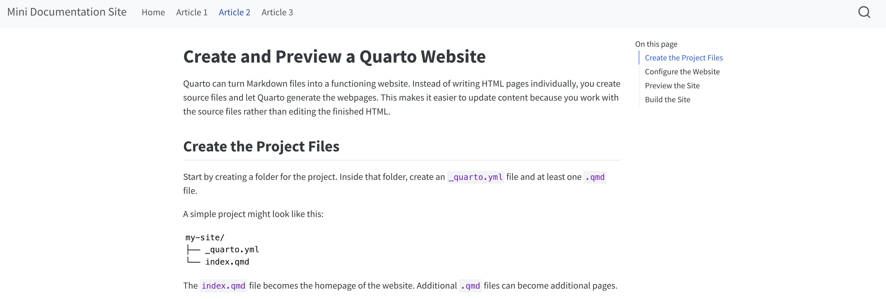

Quarto can turn Markdown files into a functioning website. Instead of writing HTML pages individually, you create source files and let Quarto generate the webpages. This makes it easier to update content because you work with the source files rather than editing the finished HTML.



## Create the Project Files

Start by creating a folder for the project. Inside that folder, create an `_quarto.yml` file and at least one `.qmd` file.

A simple project might look like this:

```text
my-site/
├── _quarto.yml
└── index.qmd
```

The `index.qmd` file becomes the homepage of the website. Additional `.qmd` files can become additional pages.

## Configure the Website

The `_quarto.yml` file controls how Quarto builds the site. A basic configuration might look like this:

```yaml
project:
  type: website

website:
  title: "My Documentation Site"

format:
  html:
    theme: cosmo
```

The `project` setting tells Quarto that the files belong to a website. The `website` section gives the site a title, while the `format` section controls how the HTML pages are generated.

## Preview the Site

Open Terminal, move into the project folder, and run:

```bash
quarto preview
```

Quarto builds the website and starts a local preview server. The site will usually open automatically in your browser. Leave Terminal running while you preview the site.

When you make changes to a `.qmd` file and save it, Quarto can update the preview so you can check your work.

When you are finished previewing, return to Terminal and press **Control + C**.

## Build the Site

To generate the website without starting a preview server, run:

```bash
quarto render
```

Quarto creates the finished HTML files in the `_site` folder. Those generated files can then be published through GitHub Pages.

For additional options and configuration examples, see the [Quarto website documentation](https://quarto.org/docs/websites/).