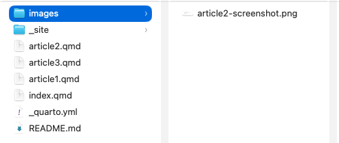

Images can help documentation explain an interface, demonstrate a result, or show readers what they should expect to see. In a Quarto website, images can be stored with the other project files and added to an article using Markdown.



## Store Images in the Project

Create an `images` folder inside the Quarto project and place the images used by the site there. Keeping them together makes the project easier to organize.

A simple project might look like this:

```text
my-site/
├── _quarto.yml
├── index.qmd
├── article.qmd
└── images/
    └── screenshot.png
```

The image file is separate from the article itself. The `.qmd` file tells Quarto where to find the image when the website is built.

## Add an Image

Markdown uses a short piece of syntax to place an image in a document:

```markdown

```

The part in parentheses tells Quarto where the image file is located. The text inside the square brackets is the image's **alt text**.

## Write Useful Alt Text

Alt text provides a text description of an image for readers who cannot see it. It should communicate what information the image contributes to the documentation.

For example:

```markdown

```

That description is more useful than something general such as `screenshot` because it identifies what the reader is supposed to notice.

## Prepare Screenshots

Before adding a screenshot, crop it so the relevant information is easy to see. Remove unnecessary desktop space, browser tabs, or other material that does not help explain the step.

Use images when they provide information that would be harder to communicate with text alone. A screenshot showing the result of a command, for example, can help readers confirm that they completed a step correctly.

After saving the image in the `images` folder, save the `.qmd` file and run `quarto preview` to check how it appears on the website.