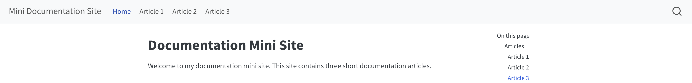

This site contains three short documentation articles about GitHub and Quarto workflows.

## Articles

### [Getting Started with GitHub Documentation](article1.qmd)

Create a GitHub repository, add files, publish with GitHub Pages, and work with collaborators.

### [Create and Preview a Quarto Website](article2.qmd)

Set up a basic Quarto website, configure it, preview changes locally, and render the finished site.

### [Add Images and Alt Text to a Quarto Website](article3.qmd)

Organize images inside a Quarto project, add them with Markdown, and write useful alt text.